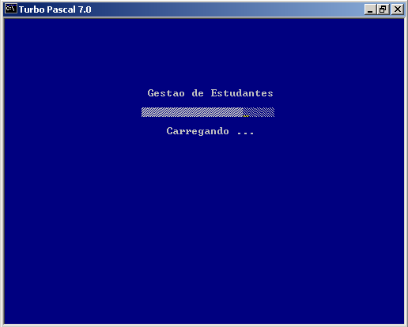
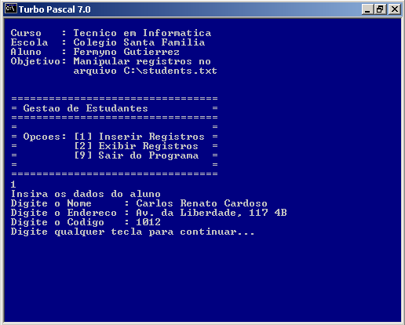
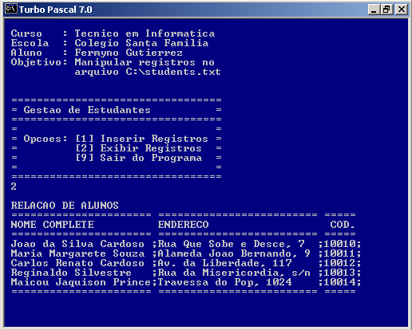

# Disciplina: Processamento de Dados III - Pascal

> **Warning**
> 
> [DEPRECATED]  
> A tecnologia em uso neste repositório encontra-se obsoleta em muitos aspectos, e foram desenvolvidos no âmbito acadêmico. Os arquivos estão mantidos neste repositório apenas para fins de demonstração e documentação. 
 

## Atividade Final

Atividades desenvolvidas no âmbito da disciplina **Processamento de Dados III - Pascal** do curso Técnico em Informática do Instituto São Francisco - Santa Família.
 

**Enunciado:** O aluno deve escrever um programa que apresente as funcionalidades listadas abaixo.  
**Ver Enunciado em PDF:** [atvfinal-instrucoes.pdf](src/atvfinal-instrucoes.pdf)
 
1. O programa deve ser escrito totalmente em Pascal e rodar no compilador Turbo Pascal;
2. O programa deve fazer uso de procedures;
3. O programa deve apresentar um código estruturado;
4. Deve permitir a inserção de dados de alunos (nome, endereço e código) via teclado e gravá-los no arquivo c:\alunos.txt;
5. Deve permitir a exibição dos dados do arquivo na tela;
6. Cada nova gravação de dados no arquivo deve ser adicionada ao final das anteriores; 
7. O programa deve apresentar um menu que permita selecionar entre: gravar dados, ler dados, ou sair do programa.  
 

## Código fonte

**Programa:** [atvfinal.pas](src/atvfinal.pas)  
 

## Capturas de Tela da Atividade Final

  

  

  

  
 

## Atividades de Exercícios

* **Atividade 1:**  
  **Programa:** [ativ_01.pas](src/ativ_01.pas)  
  **Objetivo:** Colocar em ordem decrescente 3 números lidos do teclado.

* **Atividade 2:**  
  **Programa:** [ativ_02.pas](src/ativ_02.pas)  
  **Objetivo:** Colocar em ordem crescente nomes lidos do teclado.  

* **Atividade 3:**  
  **Programa:** [ativ_03.pas](src/ativ_03.pas)  
  **Objetivo:** Exercício de escrita em disco.
  
* **Atividade 4:**  
  **Programa:** [ativ_04.pas](src/ativ_04.pas)  
  **Objetivo:** Calcular a área de um círculo.
  
* **Atividade 5:**  
  **Programa:** [ativ_05.pas](src/ativ_05.pas)  
  **Objetivo:** Converter letras para maiusculas.

* **Atividade 6:**  
  **Programa:** [ativ_06.pas](src/ativ_06.pas)  
  **Objetivo:** Converter letra para minusculas.

* **Atividade 7:**  
  **Programa:** [ativ_07.pas](src/ativ_07.pas)  
  **Objetivo:** Ler notas de alunos e listar notas menores que 6.

* **Atividade 8:**  
  **Programa:** [ativ_08.pas](src/ativ_08.pas)  
  **Objetivo:** Ler dados e ordenar pelo nome (máximo 10 pessoas).

* **Atividade 9:**  
  **Programa:** [ativ_09.pas](src/ativ_09.pas)  
  **Objetivo:** Exemplo de uso de funções.
  
 
 
