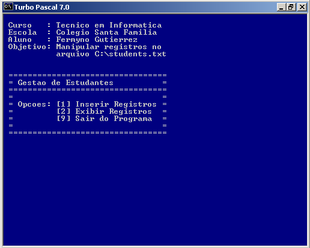

# Disciplina: Processamento de Dados III - Pascal

> **Warning**
> 
> [DEPRECATED]  
> A tecnologia em uso neste repositório encontra-se obsoleta em muitos aspectos, e foram desenvolvidos no âmbito acadêmico. Os arquivos estão mantidos neste repositório apenas para fins de demonstração e documentação. 
<br />

## Atividade Final

Atividades desenvolvidas no âmbito da disciplina **Processamento de Dados III - Pascal** do curso Técnico em Informática do Instituto São Francisco - Santa Família.
<br />

**Enunciado:** O aluno deve escrever um programa que apresente as funcionalidades listadas abaixo.  
**Ver Enunciado em PDF:** [atvfinal-instrucoes.pdf](src/atvfinal-instrucoes.pdf)
<br>
1. O programa deve ser escrito totalmente em Pascal e rodar no compilador Turbo Pascal;
2. O programa deve fazer uso de procedures;
3. O programa deve apresentar um código estruturado;
4. Deve permitir a inserção de dados de alunos (nome, endereço e código) via teclado e gravá-los no arquivo c:\alunos.txt;
5. Deve permitir a exibição dos dados do arquivo na tela;
6. Cada nova gravação de dados no arquivo deve ser adicionada ao final das anteriores; 
7. O programa deve apresentar um menu que permita selecionar entre: gravar dados, ler dados, ou sair do programa.  
<br />


## Código fonte

**Download do Programa:** [atvfinal.pas](src/atvfinal.pas)  
<br />
```pascal
Program atvfinal;
(* Curso: Tec. Informatica - Colegio Santa Familia *)
(* Atividade: trabalho final *)

Uses CRT;

(* Declaracao de variaveis *)
var
   f      : Text;
   menu   : Integer;
   x      : Integer;
   s      : string[60];
   s_name : string[60];
   s_addr : string[60];
   s_code : string[60];

(* Procedimento que exibe o menu de opcoes *)
procedure opcoes;
begin
   (* personaliza cor do fundo *)
   textbackground(9);
   (* limpa a tela *)
   clrscr;
   writeln('Curso   : Tecnico em Informatica');
   writeln('Escola  : Colegio Santa Familia');
   writeln('Aluno   : Fermyno Gutierrez');
   writeln('Objetivo: Manipular registros no');
   writeln('          arquivo C:\alunos.txt');
   writeln('');
   writeln('');
   writeln('+-------------------------------+');  
   writeln('| Gestao de Estudantes          |');  
   writeln('+-------------------------------+');  
   writeln('|                               |');
   writeln('| Opcoes: [1] Inserir Registros |');
   writeln('|         [2] Exibir Registros  |');
   writeln('|         [9] Sair do Programa  |');
   writeln('|                               |');
   writeln('+-------------------------------+');  
end;

(* Procedimento que exibe uma barra de progresso ao iniciar o programa *)
(* finalidade puramente estetica *)
procedure splash;
begin
  (* limpa a tela *)
  clrscr;
  (* loop para criar o fundo da barra de carregamento *)
  for x:=30 to 50 do
  begin
     gotoXY(x,12);
     write(chr(176));
  end;
  (* exibe mensagem na tela em determinada coordenada *)
  gotoXY(31,10);
  write('Gestao de Estudantes');
  (* exibe mensagem na tela em determinada coordenada *)
  gotoXY(31,14);
  write('   Carregando ...');
  (* loop para mostrar a barra de carregamento *)
  for x:=30 to 50 do
  begin
     gotoXY(x,12);
     write(chr(178));
     delay(50);
  end;
end;

(* Procedimento que realiza a escrita de dados no arquivo *)
Procedure file_write;
Begin
   (* le os dados do aluno no teclado *)
   writeln('Insira os dados do aluno');   
   write('Nome     : ');   
   readln(s_name);
   write('Endereco : ');   
   readln(s_addr);
   write('Codigo   : ');   
   readln(s_code);
   (* manipula o arquivo *)
   Assign(f,'c:\alunos.txt');
   Append(f);
   (* salva os dados do aluno do arquivo *)
   writeln(f, s_name,';',s_addr,';',s_code,';');
   Close(f);
   writeln('Digite qualquer tecla para continuar...');
   readkey;
End;

(* Procedimento que realiza a leitura de dados no arquivo *)
Procedure file_read;
Begin
   (* le os dados do aluno do arquivo *)
   Assign(f,'c:\alunos.txt');
   reset(f);
   (* loop de leitura do arquivo *)
   while not eof(f) do
   begin
     readln(f,s);
	 (* escreve na tela o conteudo do arquivo *)
     writeln(s);
   end;
   readln;
   close(f);
   writeln('Digite qualquer tecla para continuar...');
   {readkey;}
End;

(* rotina principal do programa *)
begin
   (* exibe tela de carregamento do programa *)
   splash;
   (* exibe opcoes do menu *)
   opcoes;
   readln(menu);
   (* execucao do programa *)
   while menu<>9 do
   begin
      Case menu of
         1: file_write; { escreve dados no arquivo }
         2: file_read;  { le dados do arquivo }
      end;
      (* exibe opcoes do menu *)
      opcoes;
      readln(menu);	  
   end;

end.

```
<br />

## Capturas de Tela da Atividade Final

  

  

  

  
<br />


## Atividades de Exercícios

* **Atividade 1:**  
  **Programa:** [ativ_01.pas](src/ativ_01.pas)  
  **Objetivo:** Colocar em ordem decrescente 3 números lidos do teclado.

* **Atividade 2:**  
  **Programa:** [ativ_02.pas](src/ativ_02.pas)  
  **Objetivo:** Colocar em ordem crescente nomes lidos do teclado.  

* **Atividade 3:**  
  **Programa:** [ativ_03.pas](src/ativ_03.pas)  
  **Objetivo:** Exercício de escrita em disco.
  
* **Atividade 4:**  
  **Programa:** [ativ_04.pas](src/ativ_04.pas)  
  **Objetivo:** Calcular a área de um círculo.
  
* **Atividade 5:**  
  **Programa:** [ativ_05.pas](src/ativ_05.pas)  
  **Objetivo:** Converter letras para maiusculas.

* **Atividade 6:**  
  **Programa:** [ativ_06.pas](src/ativ_06.pas)  
  **Objetivo:** Converter letra para minusculas.

* **Atividade 7:**  
  **Programa:** [ativ_07.pas](src/ativ_07.pas)  
  **Objetivo:** Ler notas de alunos e listar notas menores que 6.

* **Atividade 8:**  
  **Programa:** [ativ_08.pas](src/ativ_08.pas)  
  **Objetivo:** Ler dados e ordenar pelo nome (máximo 10 pessoas).

* **Atividade 9:**  
  **Programa:** [ativ_09.pas](src/ativ_09.pas)  
  **Objetivo:** Exemplo de uso de funções.
  
<br />
<br />
