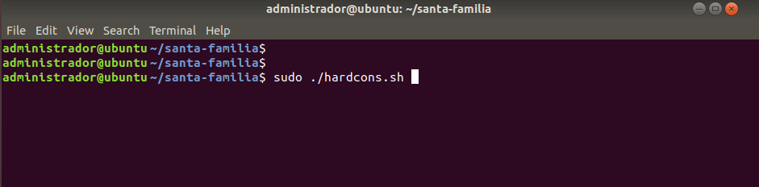
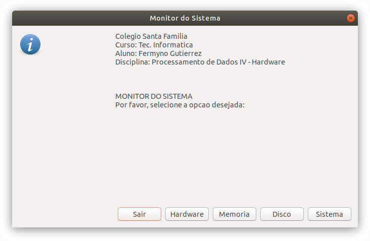
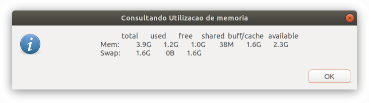
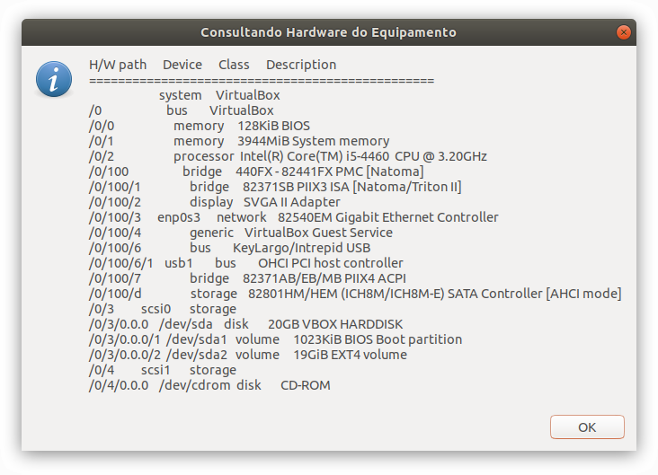
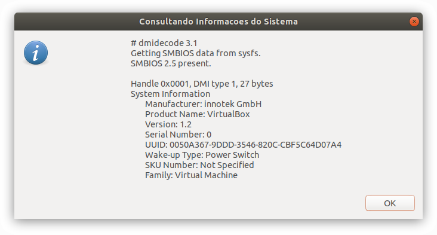

# Disciplina: Processamento de Dados IV - Hardware

> **Warning**
> 
> [DEPRECATED]  
> Os códigos em uso neste repositório foram desenvolvidos exclusivamente para fins acadêmicos. Os arquivos estão mantidos neste repositório apenas para fins de demonstração e documentação.  

## Atividade Final

Atividade desenvolvida no âmbito da disciplina **Processamento de Dados IV - Hardware** do curso Técnico em Informática do Instituto São Francisco - Santa Família.

### Enunciado

Escreva um programa em qualquer linguagem que retorne informacoes sobre o hardware do equipamento.

### Solução Apresentada
Desenvolvimento de um shell script com recursos do Zenith para exibir informações do hardware em modo gráfico no sistema operacional Linux.

### Capturas de Tela

