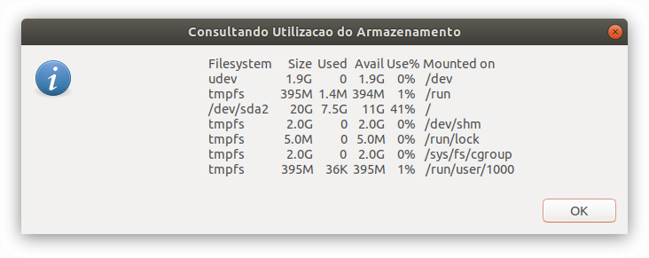

# Disciplina: Processamento de Dados IV - Hardware

> **Warning**
> 
> [DEPRECATED]  
> Os códigos em uso neste repositório foram desenvolvidos exclusivamente para fins acadêmicos. Os arquivos estão mantidos neste repositório apenas para fins de demonstração e documentação.  


## Atividade Final

Atividade desenvolvida no âmbito da disciplina **Processamento de Dados IV - Hardware** do curso Técnico em Informática do Instituto São Francisco - Santa Família.

### Enunciado

Escreva um programa em qualquer linguagem que retorne informacoes sobre o hardware do equipamento.

### Capturas de Tela





## Solução Apresentada

Desenvolvimento de um shell script com recursos do Zenith para exibir informações do hardware em modo gráfico no sistema operacional Linux.  

Link para o shell script: <a href="https://github.com/fermyno/postsecondary-technical-information-technology/blob/main/proc-dados-iv-hardware/src/hardcons.sh">hardcons.sh</a>

Código-fonte:  

```bash
#!/bin/bash

# ATENCAO:
# Este programa deve ser executado com poderes de superusuario
# no Sistema Operacional Linux
# Exemplo:
# sudo ./hardcons.sh

# Curso: Tec. Informatica - Colegio Santa Familia
# Atividade Final da disciplina Proc. Dados IV - Hardware

# Enunciado:
# Escreva um programa em qualquer linguagem que retorne
# informacoes sobre o hardware do equipamento

#menu principal
# botao OK retorna "0"
# demais botoes, retornam "1"

opcoes=1 
while [ $opcoes -eq 1 ]; do
  retorno=$(zenity --info --title 'Monitor do Sistema' \
      --text 'Colegio Santa Familia\nCurso: Tec. Informatica\nAluno: Fermyno Gutierrez\nDisciplina: Processamento de Dados IV - Hardware\n\n\n\nMONITOR DO SISTEMA\nPor favor, selecione a opcao desejada:' \
      --ok-label Sair \
      --extra-button Hardware \
      --extra-button Memoria \
      --extra-button Disco \
      --extra-button Sistema \
      --width=600 \
      --height=400
       )
  opcoes=$?
  echo "${opcoes}-${retorno}"
  echo $retorno
  
  # OPCAO: Hardware
  if [[ $retorno = "Hardware" ]]
  then
        echo "Consultando Hardware do equipamento..."
		# guarda resultado da linha de comando na variavel info_command
        info_command=$(lshw \
                         -short)
        zenity --info --text="${info_command}" --title="Consultando Hardware do Equipamento" --width=600 height=400 2>/dev/null

  # OPCAO: Memoria
  elif [[ $retorno = "Memoria" ]]
  then
        echo "Consultando Utilizacao de memoria..."
		# guarda resultado da linha de comando na variavel info_command
        info_command=$(free \
                         -h)
        zenity --info --text="${info_command}" --title="Consultando Utilizacao de memoria" --width=600 height=400 2>/dev/null

  # OPCAO: Disco
  elif [[ $retorno = "Disco" ]]
  then
        echo "Consultando Utilizacao do Armazenamento..."
		# guarda resultado da linha de comando na variavel info_command
        info_command=$(df \
                         -h)
        zenity --info --text="${info_command}" --title="Consultando Utilizacao do Armazenamento" --width=600 height=400 2>/dev/null

  # OPCAO: Sistema
  elif [[ $retorno = "Sistema" ]]
  then
        echo "Consultando Informacoes do Sistema..."
		# guarda resultado da linha de comando na variavel info_command
        info_command=$(dmidecode \
                           -t \
                           system)
        zenity --info --text="${info_command}" --title="Consultando Informacoes do Sistema" --width=600 height=400 2>/dev/null
  fi

done
```
