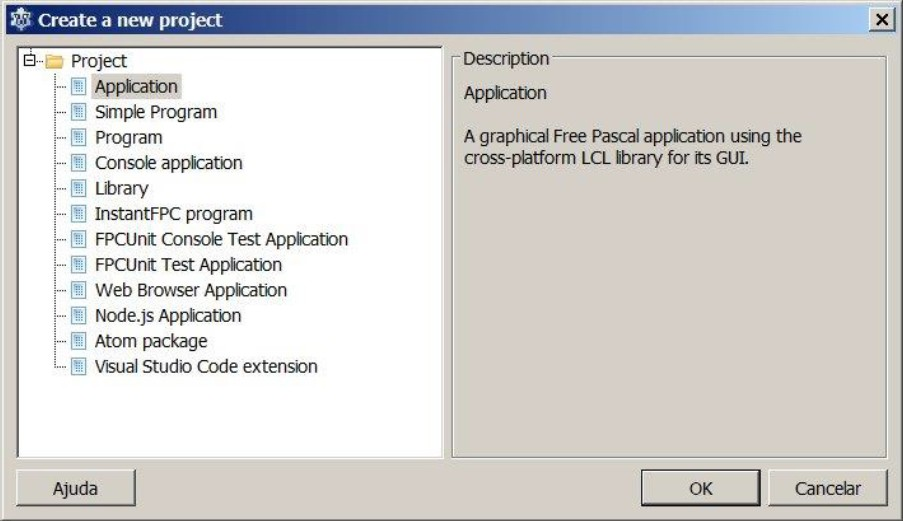

# Disciplina: Processamento de Dados V - Delphi

> **Warning**
> 
> [DEPRECATED]  
> Os códigos em uso neste repositório foram desenvolvidos exclusivamente para fins acadêmicos. Os arquivos estão mantidos neste repositório apenas para fins de demonstração e documentação. 

Atividades desenvolvidas no âmbito da disciplina **Processamento de Dados V - Delphi** do curso Técnico em Informática do Instituto São Francisco - Santa Família.
 

# Atividade Final

O aluno deve escrever um programa que apresente as seguintes funcionalidades:
1. O programa deve ser escrito totalmente em Pascal e utilizar uma das seguintes IDEs: Delphi, Kylix ou Lazarus;
2. O programa deve apresentar um código estruturado;
3. Deve permitir a consulta, inserção e remoção de dados de três tabelas distintas: alunost1.dbf, alunost2.dbf e alunost3.dbf (os arquivos .dbf serão fornecidos pelo professor);
4. O programa deve apresentar um menu que permita selecionar a tabela desejada para visualização
5. O aluno deve documentar toda a construção do programa em um arquivo de texto (MS Word ou OpenOffice Writer) contendo imagens e instruções passo-a-passo da construção do programa (obrigatório!!!).

Diante dos requisitos levantados, optou-se por uma solução com foco na usuabilidade, composta por uma interface simples e intuitiva que permite rapidamente a consulta dos alunos de todas as turmas. É possível, ainda, editar as notas dos alunos de forma rápida e simplificada.  
Para a etapa de codificação do programa foi utilizada a IDE Lazarus, devido ao seu código de uso aberto e possibilidade de compilação para as plataformas Windows e Linux. 
 

# Captura de Tela

 

# Código-fonte
  
Relação de arquivos do programa:  
* **💾 **
* **💾 **
* **💾 **
* **💾 **
* **💾 **
* **💾 **
* **💾 **
* **💾 **
* **📅 **
* **📅 **
* **📅 **
 

Todos os arquivos zipados:  
* **📦 **
 

# Passo-a-passo para a construção do programa

Todos os passos necessários para a construção do programa estão relatados detalhadamente no seguinte documento:  
* **📘 .**
 

### ETAPA DE CRIAÇÃO DO PROJETO
 

#### ETAPA 1
No Lazarus, clicar em <code>Project</code> + <code>New Project</code> + <code>Application</code>
 

 
 

#### ETAPA 2
Clicar em <code>File</code> + <code>Save All</code> + selecionar pasta C:\alunos\, salvar projeto como <code>alunos.lpi</code>, e salvar arquivo <code>.pas</code> como <code>unit1.pas</code>.
 

 

### ETAPA DE CRIAÇÃO DO LAYOUT DO PROGRAMA
 

#### -- FORM 1 --
 

#### ETAPA 3
No Lazarus, clicar em <code>Project</code> + <code>New Project</code> + <code>Application</code>
 
 

#### ETAPA 4
Clicar em <code>File</code> + <code>Save All</code> + selecionar pasta C:\alunos\, salvar projeto como <code>alunos.lpi</code>, e salvar arquivo <code>.pas</code> como <code>unit1.pas</code>.
 
 

#### ETAPA 5
Na aba <code>Data Controls</code> inserir os componentes <code>TDBNavigator (DBNavigator1)</code> e <code>TDBGrid (DBGrid1)</code>”
 
 

#### ETAPA 6
Na aba <code>Standard</code> adicionar um <code>TButton (Button1)</code>. Alterar a propriedade <code>Caption</code> do <code>Button1</code> para <code>Sair</code>
 
 

#### ETAPA 7
Na aba <code>Standard</code> adicionar um <code>TLabel (Label1)</code>. Alterar as propriedades <code>Font</code> para <code>Negrito 14</code>.
 
 

#### ETAPA 8
Na aba <code>Standard</code> adicionar um <code>TmainMenu (MainMenu1)</code>.
 
 

#### ETAPA 9
Clicar duas vezes no <code>MainMenu1</code> para iniciar edição do menu. Clicar em <code>Add menu item</code> e na propriedade <code>Caption</code> digitar <code>&Arquivo</code>.
 
 

#### ETAPA 10
Clicar em <code>Add submenu</code> e na propriedade <code>Caption</code> do <code>MenuItem2</code> digitar <code>&Sair</code>.
 
 

#### ETAPA 11
Clicar em <code>Arquivo</code> para habilitar a adição de mais itens de menu. Clicar em <code>Add menu item</code>. Em <code>MenuItem3</code> alterar a propriedade <code>Caption</code> para <code>&Turmas</code>.
 
 

#### ETAPA 12
Clicar em <code>Add submenu</code> e na propriedade <code>Caption</code> alterar para <code>Turma &1</code>. Realizar o mesmo procedimento para as turmas 2 e 3.
 
 

#### ETAPA 13
Clicar em <code>Turmas</code> para habilitar a adição de mais itens de menu. Clicar em <code>Add menu item</code>. Em <code>MenuItem7</code> alterar a propriedade <code>Caption</code> para <code>&Ajuda</code>.
 
 

#### ETAPA 14
Clicar em <code>Add submenu</code> e na propriedade <code>Caption</code> do <code>MenuItem8</code> alterar para <code>So&bre</code>.
 
 

#### ETAPA 15
Fechar a edição do menu.
 
 

 

#### -- FORM 2 --
 

#### ETAPA 16
Clicar em <code>File</code> + <code>New Form</code>.
Clique em <code>File</code> + <code>Salve All</code> e salve o novo formulario como <code>unit2.pas</code>
 
 

#### ETAPA 17
Um novo formulário será criado. Na propriedade <code>Caption</code> digite <code>Sobre o Programa</code>.
 
 

#### ETAPA 18
Na propriedade <code>BorderStyle</code> do novo formulário digite <code>bsDialog</code>.
 
 

#### ETAPA 19
Adicione os componentes <code>TLabel (Form2.Label1)</code> e <code>Tbutton (Form2.Button1)</code>.  
No componente <code>TLabel (Form2.Label1)</code> configure a propriedade <code>Font</code> para <code>Normal</code> e <code>Tamanho 11</code>.  
No componente <code>Tbutton (Form2.Button1)</code> configure a propriedade <code>Caption</code> para <code>OK</code>.
 
 

 

### ETAPA DE CODIFICAÇÃO DO PROGRAMA
 

#### -- CODIFICAÇÃO DO FORM 1 --
 

#### ETAPA 20
Na “Unit1” localize o código “{$mode objfpc}{$H+}” e adicione “unit2” antes do ponto-e-vírgula.
 
 

#### ETAPA 21
Na “Unit1” localize a procedure “TForm1.FormCreate(Sender: TObject)”
 
 

#### ETAPA 22
Clique duas vezes em um espaço vazio do Form1, e na procedure “TForm1.FormCreate(Sender: TObject)” digite o seguinte código:
<code>
{ codigo carregado na criacao do formulario princial }
Form1.Label1.Caption := 'Controle de Alunos';
{ configuracao das base de dados }
Form1.DBGrid1.DataSource := Form1.DataSource1;
Form1.DBNavigator1.DataSource := Form1.DataSource1;
{ define Turma 1 como primeira turma a ser visualizada }
Form1.Label1.Caption := 'Controle de Alunos - Turma 1';
Form1.Dbf1.TableName := 'C:\alunos\alunosT1.dbf';
Form1.Dbf1.FilePath := 'C:\alunos\';
Form1.Dbf1.FilePathFull := 'C:\alunos\';
Form1.Dbf1.StoreDefs := True;
Form1.Dbf1.Active := True;
Form1.DataSource1.DataSet := Form1.Dbf1
</code>
 
 

#### ETAPA 23
Clicar duas vezes no “Form1.Button1” (Botão de sair) e digitar o seguinte código na procedure “TForm1.Button1Click(Sender: TObject)”: 
<code>
{ sair do programa }
Close;
</code>
 
 

#### ETAPA 24
Clicar no menu, na opção “Arquivo” + “Sair” e e digitar o mesmo código na procedure “TForm1.MenuItem2Click(Sender: TObject)”:
<code>
{ sair do programa }
Close;
</code>
 
 

#### ETAPA 25
Clicar no menu, na opção “Ajuda” + “Sobre” e digitar o seguinte código na procedure “TForm1.MenuItem8Click(Sender: TObject)”:
<code>
{ abrir formulario Ajuda > Sobre }
Form2.Show;
</code>
 
 

#### ETAPA 26
Clicar no menu, na opção “Turmas” + “Turma 1” e digitar o seguinte código na procedure “TForm1.MenuItem4Click(Sender: TObject)”:
<code>
{ atualiza o nome da turma no label }
Form1.Label1.Caption := 'Controle de Alunos - Turma 1';
{ carrega os dados da tabela c:\alunos\alunosT1.dbf }
Form1.Dbf1.Active := False;
Form1.Dbf1.TableName := 'C:\alunos\alunosT1.dbf';
Form1.Dbf1.Active := True;
</code>
 
 

#### ETAPA 27
Clicar no menu, na opção “Turmas” + “Turma 2” e digitar o seguinte código na procedure “TForm1.MenuItem5Click(Sender: TObject)”:
<code>
{ atualiza o nome da turma no label }
Form1.Label1.Caption := 'Controle de Alunos - Turma 2';
{ carrega os dados da tabela c:\alunos\alunosT2.dbf }
Form1.Dbf1.Active := False;
Form1.Dbf1.TableName := 'C:\alunos\alunosT2.dbf';
Form1.Dbf1.Active := True;
</code>
 
 

#### ETAPA 28
Clicar no menu, na opção “Turmas” + “Turma 3” e digitar o seguinte código na procedure “TForm1.MenuItem6Click(Sender: TObject)”:
<code>
{ atualiza o nome da turma no label }
Form1.Label1.Caption := 'Controle de Alunos - Turma 3';
{ carrega os dados da tabela c:\alunos\alunosT3.dbf }
Form1.Dbf1.Active := False;
Form1.Dbf1.TableName := 'C:\alunos\alunosT3.dbf';
Form1.Dbf1.Active := True;
</code>
 
 

#### ETAPA 29
Ao final da edição das opções de turmas no menu, o código deve ficar como apresentado abaixo:
 
 

#### -- CODIFICAÇÃO DO FORM 2 --
 

#### ETAPA 30
Na “Unit2”, clique duas vezes no botão de sair e digite o código:
<code>
{ fecha o formulario Ajuda > Sobre }
Form2.Close;
</code>
 
 

#### ETAPA 31
Clique duas vezes em um espaço vazio do Form2, e na procedure “TForm2.FormCreate(Sender: TObject)” digite o seguinte código:
<code>
{ define o texto do formulario de Ajuda > Sobre }
Form2.Label1.Caption := 'Autor: Fermyno Gutierrez'#10'Controle de Alunos';
</code>
 
 
